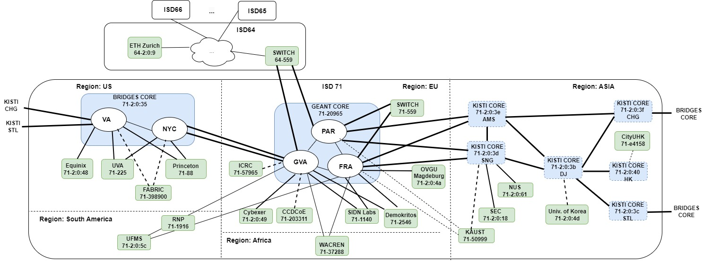

SCION Education, Research and Academic Network
===============================================

Welcome to the official documentation to run your AS in the SCION Education, Research and Academic Network (SCIERA). On this site, you can find information about the network, and how to deploy and run your AS to participate. `SCION <https://scion-architecture.net/>`_ is the first clean-slate Internet architecture designed to provide route control, failure isolation, and explicit trust information for end-to-end communication. Our goal for SCIERA is to connect universities and national research and education networks (NRENs) to provide native SCION connectivity to students and researchers, in an overlay-free, productive network.

SCIERA currently spans over five regions: EU, ASIA, North and South America, as well as Africa (under construction). Major regions are represented by one core-AS and connect multiple research entities running their own ASes. SCIERA is also connected to `Anapaya's Production Network <https://www.anapaya.net/>`_ through ISD 64. The current deployment status of SCIERA is the following:

.. toctree::
  :maxdepth: 1
  :caption: SCIERA
  :hidden: 

  join
  applications
  services
  monitoring
  troubleshooting
  weblinks
  news
