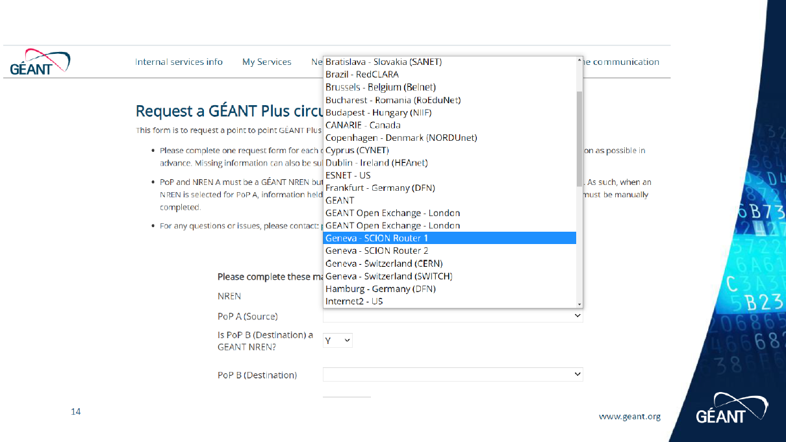

Join the Network
=====

To join the SCION Education, Research and Academic, there are several possibilities depending on your location:

Connect to GEANT (EU)
----------------
You can connect to the network via setting up a `GEANT plus link <https://www.geant3.archive.geant.org/pages/Services/GEANTPlus.html/>`_, i.e. using one or more dedicated VLANs, to our Points-of-Presence (PoP). 

We currently have 3 productive SCION PoPs:

- Frankfurt - SCION Router 1
- Paris - SCION Router 1
- Geneva - SCION Router 1

GEANT will forward the VLAN over the GEANT Plus link as tagged VLAN to the corresponding SCION PoP. You can discuss the VLAN tag with GEANT or you may also do VLAN translation.

You should be able to select them in the GEANT service portal when you request a GEANT Plus circuit:

Here are `further information about the GEANT Plus Link <https://network.geant.org/wp-content/uploads/2021/11/GEANT-Plus-Service-Description-October-2021.pdf/>`_

Connect to BRIDGES (US)
----------------

To connect to the network over BRIDGES, please contact us for further information.

Connect to KISTI (ASIA/Global)
----------------
Also a connection over KISTI is possible. Please contact us for further information.

Install SCION
----------------
So far we recommend to use Ubuntu to run SCION. You can install the packages from the official repository:

On Ubuntu, you can install SCION from our .deb-packages by running:

.. code-block:: console

  sudo apt-get install apt-transport-https ca-certificates
  echo "deb [trusted=yes] https://packages.netsec.inf.ethz.ch/debian all main" | sudo tee /etc/apt/sources.list.d/scionlab.list
  sudo apt-get update
  sudo apt-get install scionlab

Apply Configuration
----------------

After connecting to the network and setting up your host, the next step is to apply your dedicated SCION configuration. You will receive it as .tar.gz file and an install script from us. Please copy both files somewhere on your host and run 

.. code-block:: console

  sudo ./install.sh host1.tar.gz

This will install the proper SCION configuration and start all the services.

Check Connectivity
----------------

After applying the configuration, SCION needs a moment to retrieve beacons and to create paths. After a minute, try to run 

.. code-block:: console

  scion showpaths 71-20965 

to see if your AS has SCION connectivity to the network. If not, please have a look at troubleshooting.
